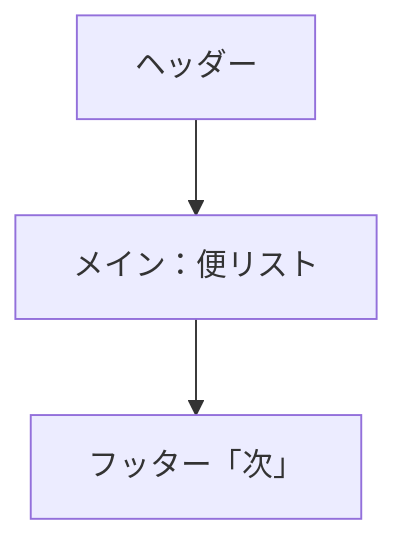

# 基本設計書

## 1. システムの目的

工場内に入線するトラック便のスケジュール・仕入先などを、大型モニタに「わかりやすく」一覧表示し、さらに音声案内で作業者に通知することで、搬入業務の効率化・ヒューマンエラーの低減を図る。

---

## 2. システム構成

- **管理PC**（Apache Webサーバ＋本アプリを配置。データ・設定管理。）
- **モニタPC**（各表示パネルごとに設置。Webブラウザで「モニタ画面」を自動表示。音声ON/OFFは端末構成/設定で切替）
- **LAN接続**（すべて有線または信頼できるローカルネットワーク上に設置）

```mermaid
graph TB
    subgraph 管理PC
      A[Webサーバ（Apache）]
      B[モニタ表示アプリ]
      C[Excel変換バッチ]
      D[設定ファイル・データ]
    end
    subgraph モニタPC
      E[ブラウザ表示画面]
      F[スピーカー(有無により)]
    end
    A-->|データ/画面配信|E
    B-->|設定反映|E
    E-->|音声|F
```

---

## 3. 主なユーザー機能・画面説明

### 3.1 トラック予定の表示

- モニタ表示例：
  - **ヘッダ**: タイトル・最新時刻・エラー情報
  - **メイン**: 入線時刻（橙大字）、仕入先名（橙大字）、　流動レーン・準備・置場（緑字）、備考（白字）
  - **フッタ**: 「次」便　の案内をやや小さく表示

- 2社同時便は1列に結合表示
- Excelデータ由来の読み仮名つき（音声合成用）
- 「表示件数・内容」は各モニタごとに個別設定可

### 3.2 音声案内機能

- 入線予定に従い、各PCの音声ON/OFF設定ごとに「指定タイミング」で音声合成案内
  - 例：「●●がにゅうせんします。■■のじゅんびをおねがいします」
- 案内タイミングは複数回（例：5分前・直前など）
- 放送開始音／終了音もあり
- すでに再生済み便は重複案内しない（ローカルストレージで管理）

### 3.3 モニタごとの個別カスタマイズ

- JSON形式の設定で、各画面の表示件数・音声案内・使用言語・テンプレート等を管理者が調整
- 追加・削除も設定ファイルだけでOK

---

## 4. データ投入・メンテナンス手順

- **Excel予定表を管理PCの所定フォルダへ設置**
- 柔軟に列マッピング・シート指定も可能（設定ファイル編集）
- 付属バッチスクリプトにより「JSON形式」に自動変換
- 変換データ/設定変更はモニタ側に自動反映（10秒ごと自動更新）

---

## 5. 調整・トラブル時の振る舞い

- 必須データ異常やネットワーク障害時は例外throw＆エラーメッセージ（「Fail Fast」方針）
- 設定失敗時などもエラー明示し、安易な初期値フォールバックはなし
- データ復旧・再投入後は自動復帰

---

## 6. 画面イメージ


単一表示・分割（東/西）の2パターン。レスポンシブ対応。

---

## 7. 運用イメージ例

1. Excel入力 → 変換バッチ実行 → 定期自動配信
2. 現場作業者は各担当エリアのモニタや音声で行動
3. 設定/レイアウト修正や増設も「JSONファイル編集+リロード」だけで対応

---

## 8. カスタマイズ／運用可能な項目

- 表示件数
- 音声フォーマット・タイミング・言語
- 画面タイトル
- データ取得間隔
- Excel列構成・シート名

---

## 9. セキュリティ・管理

- パスワード・個人情報は取り扱わない設計
- 音声案内や表示内容はすべて設定で制御
- 管理PC側で適切なアクセス制御を推奨

---

**本書は現場利用者／導入担当者向けの抜粋です。  
詳細なデータ処理・メンテナンス仕様・拡張方法等は「詳細設計書.md」を参照のこと。**
