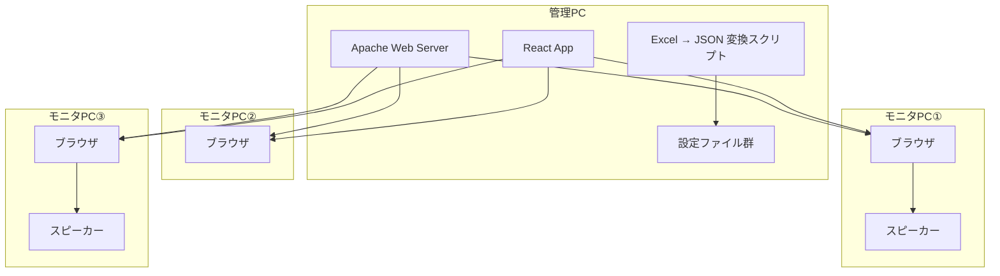
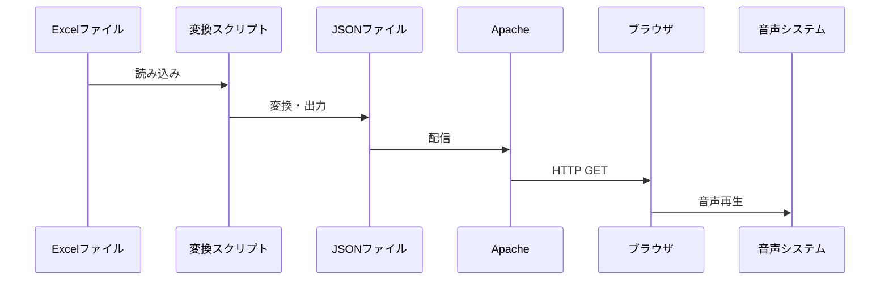
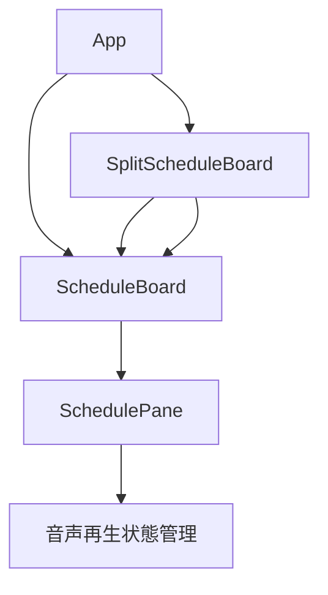
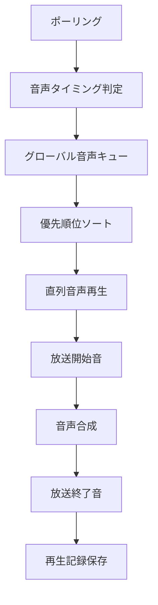

# トラック便表示システム 詳細設計書

## 1. システム概要

### 1.1 目的
工場に入線するトラックの予定時刻や仕入れ先などの情報を天吊りモニタに表示するとともに、音声による案内を行うことで、構内作業者の業務効率化を目的とする。

### 1.2 システム構成
- **管理PC**: Apache Webサーバー + React アプリケーション
- **モニタPC①**: スピーカー付き（音声案内あり）
- **モニタPC②**: スピーカーなし（音声案内なし）
- **モニタPC③**: スピーカー付き（音声案内あり）

### 1.3 技術スタック
- **フロントエンド**: React 18.2.0 + TypeScript 5.3.3
- **ビルドツール**: Vite 7.1.7
- **UI フレームワーク**: React Bootstrap 2.10.10
- **データ処理**: XLSX 0.18.5 (Excel → JSON 変換)
- **音声合成**: Web Speech API
- **Webサーバー**: Apache (本番環境)

## 2. アーキテクチャ設計

### 2.1 全体アーキテクチャ



### 2.2 ディレクトリ構造

```
essahoisa/
├── config/                    # 統合設定ファイル
│   └── app-config.json
├── public/                    # 静的ファイル
│   └── data/                  # 変換済みJSON + 音声ファイル
│       ├── east.json
│       ├── west.json
│       ├── broadcasting-start1.mp3
│       └── broadcasting-end1.mp3
├── scripts/                   # バッチ処理
│   └── convert-excel.ts
├── src/                       # React アプリケーション
│   ├── components/            # UI コンポーネント
│   ├── hooks/                 # カスタムフック
│   ├── utils/                 # ユーティリティ
│   ├── types.ts              # 型定義
│   └── styles.css            # スタイル
└── 発車データ.xlsx           # 元データ
```

## 3. データ設計

### 3.1 型定義

#### 3.1.1 基本エンティティ

```typescript
// スケジュールエントリ
interface ScheduleEntry {
  id: string;                    // 一意識別子
  order?: string;                // 表示順序
  arrivalTime: string;           // 入線時間 (HH:MM)
  finishTime?: string;           // 終了時間 (HH:MM)
  supplierName: string;          // 仕入先名
  preparation?: string;          // 準備 (単独・2社)
  note?: string;                 // 備考
  yard?: string;                 // 置場
  lane?: string;                 // 流動レーン
  supplierReading?: string;      // 仕入先名読み仮名
  materialReading?: string;      // 資材名読み仮名
}

// スケジュールファイル
interface ScheduleFile {
  meta?: {
    sheetName?: string;          // シート名
    sourceFile?: string;         // 元ファイル名
    generatedAt?: string;        // 生成日時
    configKey?: string;          // 設定キー
  };
  entries: ScheduleEntry[];
}
```

#### 3.1.2 設定関連

```typescript
// 音声設定
interface AudioSettings {
  timings: number[];             // 音声案内タイミング (分単位)
}

// モニタ設定
interface MonitorConfig {
  id: string;                    // モニタID
  title: string;                 // 表示タイトル
  dataUrl: string;               // データファイルURL
  hasAudio: boolean;             // 音声案内有無
  speechFormat?: string;         // 音声テンプレート
  speechRate?: number;           // 音声速度
  speechPitch?: number;          // 音声ピッチ
  speechLang?: string;           // 音声言語
  audioSettings?: AudioSettings; // 音声設定
}

// アプリケーション設定
interface AppConfig {
  configVersion?: string;        // 設定バージョン
  defaultMonitorId?: string;     // デフォルトモニタID
  pollingIntervalSeconds?: number; // ポーリング間隔
  speechFormat: string;          // デフォルト音声テンプレート
  displaySettings?: DisplaySettings;
  monitors: MonitorConfig[];
}
```

### 3.2 データフロー



## 4. コンポーネント設計

### 4.1 コンポーネント階層



### 4.2 主要コンポーネント

#### 4.2.1 App コンポーネント
- **責任**: ルーティング、全画面表示制御
- **機能**:
  - URL パラメータ解析
  - 単一表示/分割表示の判定
  - 全画面表示の自動実行

#### 4.2.2 ScheduleBoard コンポーネント
- **責任**: メイン表示ロジック
- **機能**:
  - データ取得・表示
  - エラーハンドリング
  - ローディング状態管理
  - 音声案内制御

#### 4.2.3 SchedulePane コンポーネント
- **責任**: 個別エントリの表示
- **機能**:
  - エントリ情報の表示
  - 音声再生状態の視覚的フィードバック
  - 分割表示対応

#### 4.2.4 SplitScheduleBoard コンポーネント
- **責任**: 左右分割表示
- **機能**:
  - 2つのモニタを並列表示
  - エラー状態の個別処理

## 5. フック設計

### 5.1 カスタムフック一覧

#### 5.1.1 useUrlParams
- **責任**: URL パラメータ解析
- **戻り値**:
  - `monitorIds`: モニタID配列
  - `isSplitView`: 分割表示フラグ
  - `monitor`: 単一表示用モニタ設定
  - `leftMonitor`, `rightMonitor`: 分割表示用モニタ設定

#### 5.1.2 useScheduleBoard
- **責任**: スケジュール表示ロジック統合
- **機能**:
  - ポーリング管理
  - データ取得・表示
  - 音声案内制御

#### 5.1.3 usePolling
- **責任**: データポーリング管理
- **機能**:
  - 設定・データの定期取得
  - 音声案内タイミング制御
  - エラーハンドリング

## 6. 音声システム設計

### 6.1 音声再生アーキテクチャ



### 6.2 音声再生フロー

1. **タイミング判定**: 設定されたタイミングで音声案内が必要かチェック
2. **重複防止**: 既に再生済みの便はスキップ
3. **キューイング**: グローバル音声キューに追加
4. **優先順位**: 到着時刻 → 上段/下段 → 左/右の順でソート
5. **直列再生**: 音声を順次再生（並列再生なし）
6. **記録保存**: ローカルストレージに再生記録を保存

### 6.3 音声設定

```json
{
  "audioSettings": {
    "timings": [300, 50, 25, 20, 15, 10, 5, 0]
  }
}
```
- 入線時間の何分前に音声案内するかを配列で指定
- 例: 300分前、50分前、25分前...など

## 7. データ変換システム

### 7.1 Excel → JSON 変換

#### 7.1.1 変換スクリプト (`scripts/convert-excel.ts`)
- **入力**: Excel ファイル + 設定ファイル
- **出力**: JSON ファイル群
- **機能**:
  - 複数シート対応
  - 2社同時入線の自動検出・結合
  - 設定ファイルによる柔軟な列マッピング

#### 7.1.2 設定ファイル (`config/excel-config.json`)
```json
{
  "headerRows": 3,
  "terminationColumn": "arrivalTime",
  "twoSupplierJoiner": "\n",
  "columns": {
    "order": "B",
    "arrivalTime": "C",
    "finishTime": "D",
    "supplierName": "E",
    "preparation": "F",
    "note": "G",
    "yard": "H",
    "lane": "I",
    "supplierReading": "J",
    "materialReading": "K"
  },
  "sheets": [
    {
      "key": "east",
      "sheetName": "東側時間順 ",
      "outputFile": "east.json"
    }
  ]
}
```

### 7.2 2社同時入線処理

1. **検出**: 入線時間列が空で仕入先列に値がある行を検出
2. **結合**: 複数行の仕入先名を改行文字で結合
3. **統合**: 1つのエントリとして処理

## 8. 表示システム設計

### 8.1 画面レイアウト

#### 8.1.1 単一表示
```
┌─────────────────────────────────┐
│           ヘッダー              │
│        (紺色背景・白文字)        │
├─────────────────────────────────┤
│                                 │
│        メインセクション          │
│        (黒背景)                 │
│  入線時刻(橙) 仕入先名(橙)       │
│  流動レーン(緑) 準備(緑) 置場(緑) │
│  備考(白)                      │
│                                 │
├─────────────────────────────────┤
│        フッターセクション        │
│        (黒背景)                 │
│  ○次 入線時刻 仕入先名...       │
└─────────────────────────────────┘
```

#### 8.1.2 分割表示
```
┌─────────────────┬─────────────────┐
│   左パネル      │   右パネル      │
│  (東置場)       │  (西置場)       │
├─────────────────┼─────────────────┤
│   メイン表示    │   メイン表示    │
├─────────────────┼─────────────────┤
│   フッター表示  │   フッター表示  │
└─────────────────┴─────────────────┘
```

### 8.2 レスポンシブデザイン

- **フォントサイズ**: `clamp()` 関数による可変サイズ
- **分割表示**: 画面幅に応じた自動調整
- **全画面表示**: 自動実行による最適化

## 9. 設定管理システム

### 9.1 設定ファイル構成

#### 9.1.1 統合設定ファイル (`config/app-config.json`)
```json
{
  "configVersion": "1.0",
  "defaultMonitorId": "1",
  "pollingIntervalSeconds": 30,
  "speechFormat": "{supplierReading}、がにゅうせんします。{materialReading}、のじゅんびをおねがいします。",
  "displaySettings": {
    "beforeMinutes": 630,
    "emptyTimeMessage": "{beforeMinutes}分以内の入線予定はありません"
  },
  "monitors": [
    {
      "id": "1",
      "title": "東置場",
      "dataUrl": "/data/east.json",
      "hasAudio": true,
      "speechLang": "ja-JP",
      "audioSettings": {
        "timings": [300, 50, 25, 20, 15, 10, 5, 0]
      }
    }
  ],
  "excel": {
    "headerRows": 3,
    "terminationColumn": "arrivalTime",
    "twoSupplierJoiner": "\n",
    "columns": {
      "order": "B",
      "arrivalTime": "C",
      "finishTime": "D",
      "supplierName": "E",
      "preparation": "F",
      "note": "G",
      "yard": "H",
      "lane": "I",
      "supplierReading": "J",
      "materialReading": "K"
    },
    "sheets": [
      {
        "key": "east",
        "sheetName": "東側時間順 ",
        "outputFile": "east.json"
      }
    ]
  }
}
```

### 9.2 統合設定の利点

- **一元管理**: すべての設定が1つのファイルで管理可能
- **関連性の明確化**: モニタ設定とExcel設定の関連性が分かりやすい
- **デプロイの簡素化**: 設定ファイルの配布が簡単
- **保守性の向上**: 設定変更時の影響範囲が明確

### 9.3 動的設定更新

- **ポーリング**: 10秒間隔で設定ファイルを再取得
- **ホットリロード**: 設定変更を即座に反映
- **フォールバック**: 設定取得失敗時は既存設定を使用

## 10. エラーハンドリング

### 10.1 エラー分類

#### 10.1.1 データ取得エラー
- **原因**: ネットワークエラー、ファイル不存在
- **対応**: エラーメッセージ表示、既存データ保持

#### 10.1.2 設定取得エラー
- **原因**: 設定ファイル破損、ネットワークエラー
- **対応**: デフォルト設定使用、エラーログ出力

#### 10.1.3 音声再生エラー
- **原因**: 音声API 非対応、ファイル不存在
- **対応**: 音声スキップ、エラーログ出力

### 10.2 ログシステム

```typescript
enum LogLevel {
  ERROR = 0,
  WARN = 1,
  INFO = 2,
  DEBUG = 3
}
```

- **重複排除**: 10秒以内の同一メッセージは除外
- **レベル制御**: 本番環境はINFO、開発環境はDEBUG
- **タイムスタンプ**: 全ログに時刻情報付与

## 11. パフォーマンス最適化

### 11.1 メモリ管理

- **ポーリング管理**: シングルトンパターンによる重複防止
- **ローカルストレージ**: 4MB制限、古いデータの自動削除
- **音声キュー**: バッチ処理による効率化

### 11.2 レンダリング最適化

- **条件レンダリング**: 不要な再レンダリングを防止
- **メモ化**: `useMemo` による計算結果キャッシュ
- **状態管理**: 最小限の状態更新

## 12. セキュリティ考慮事項

### 12.1 データ保護

- **ローカルストレージ**: 機密情報の保存禁止
- **入力検証**: 設定ファイルの妥当性チェック
- **XSS対策**: 動的コンテンツの適切なエスケープ

### 12.2 アクセス制御

- **URL パラメータ**: モニタID による表示制御
- **設定ファイル**: 読み取り専用アクセス
- **音声ファイル**: 静的ファイルとして配信

## 13. 運用・保守

### 13.1 デプロイメント

#### 13.1.1 開発環境
```bash
npm install
npm run dev
```

#### 13.1.2 本番環境
```bash
npm run build
# dist/ を Apache のドキュメントルートに配置
```

### 13.2 データ更新フロー

1. Excel ファイル更新
2. 変換スクリプト実行（統合設定ファイルを使用）
3. JSON ファイル生成
4. Apache による自動配信
5. ブラウザでの自動更新

### 13.3 設定更新フロー

1. `config/app-config.json` を編集
2. Apache による自動配信
3. ブラウザでの自動更新（10秒間隔のポーリング）

### 13.4 監視・ログ

- **ブラウザコンソール**: デバッグ情報出力
- **ローカルストレージ**: 音声再生記録
- **ネットワーク**: データ取得状況

## 14. 拡張性・カスタマイズ

### 14.1 設定によるカスタマイズ

- **列マッピング**: Excel の列構成変更対応
- **音声テンプレート**: 音声案内内容の変更
- **表示設定**: フォントサイズ、色、レイアウト

### 14.2 機能拡張ポイント

- **新しいモニタ**: 設定ファイルに追加するのみ
- **音声設定**: タイミングや言語の追加
- **表示形式**: コンポーネントの拡張

## 15. 技術的制約・注意事項

### 15.1 ブラウザ対応

- **音声合成**: Web Speech API 対応ブラウザが必要
- **ローカルストレージ**: 対応ブラウザでのみ動作
- **全画面表示**: ユーザーインタラクション後に実行

### 15.2 パフォーマンス制約

- **音声再生**: 直列処理のため同時再生不可
- **メモリ使用量**: 長時間運用時のメモリリーク対策
- **ネットワーク**: ポーリングによる帯域使用

### 15.3 運用制約

- **Excel 形式**: 固定フォーマットが必要
- **ファイル配置**: Apache の配信範囲内に配置
- **時刻設定**: システム時刻の正確性が重要

---

## 付録

### A. ファイル一覧

| ファイル | 役割 | 重要度 |
|---------|------|--------|
| `src/App.tsx` | メインアプリケーション | 高 |
| `src/components/ScheduleBoard.tsx` | 表示ロジック | 高 |
| `src/hooks/usePolling.ts` | データ取得・音声制御 | 高 |
| `src/utils/audioPlaybackState.ts` | 音声システム | 高 |
| `scripts/convert-excel.ts` | データ変換 | 中 |
| `public/config/monitor-config.json` | 設定ファイル | 高 |

### B. 主要な技術仕様

- **React**: 18.2.0 (関数コンポーネント + フック)
- **TypeScript**: 5.3.3 (厳密な型チェック)
- **Vite**: 7.1.7 (高速ビルド)
- **Bootstrap**: 5.3.8 (レスポンシブUI)
- **XLSX**: 0.18.5 (Excel 処理)

### C. 設定例

#### C.1 モニタ設定例
```json
{
  "id": "1",
  "title": "東置場",
  "dataUrl": "/data/east.json",
  "hasAudio": true,
  "speechLang": "ja-JP",
  "audioSettings": {
    "timings": [300, 50, 25, 20, 15, 10, 5, 0]
  }
}
```

#### C.2 統合設定ファイル例
```json
{
  "configVersion": "1.0",
  "defaultMonitorId": "1",
  "pollingIntervalSeconds": 30,
  "speechFormat": "{supplierReading}、がにゅうせんします。{materialReading}、のじゅんびをおねがいします。",
  "displaySettings": {
    "beforeMinutes": 630,
    "emptyTimeMessage": "{beforeMinutes}分以内の入線予定はありません"
  },
  "monitors": [
    {
      "id": "1",
      "title": "東置場",
      "dataUrl": "/data/east.json",
      "hasAudio": true,
      "speechLang": "ja-JP",
      "audioSettings": {
        "timings": [300, 50, 25, 20, 15, 10, 5, 0]
      }
    }
  ],
  "excel": {
    "headerRows": 3,
    "terminationColumn": "arrivalTime",
    "twoSupplierJoiner": "\n",
    "columns": {
      "arrivalTime": "C",
      "supplierName": "E",
      "supplierReading": "J",
      "materialReading": "K"
    }
  }
}
```

---

*この設計書は 2025年1月時点の仕様に基づいています。システムの変更に伴い、適宜更新してください。*
